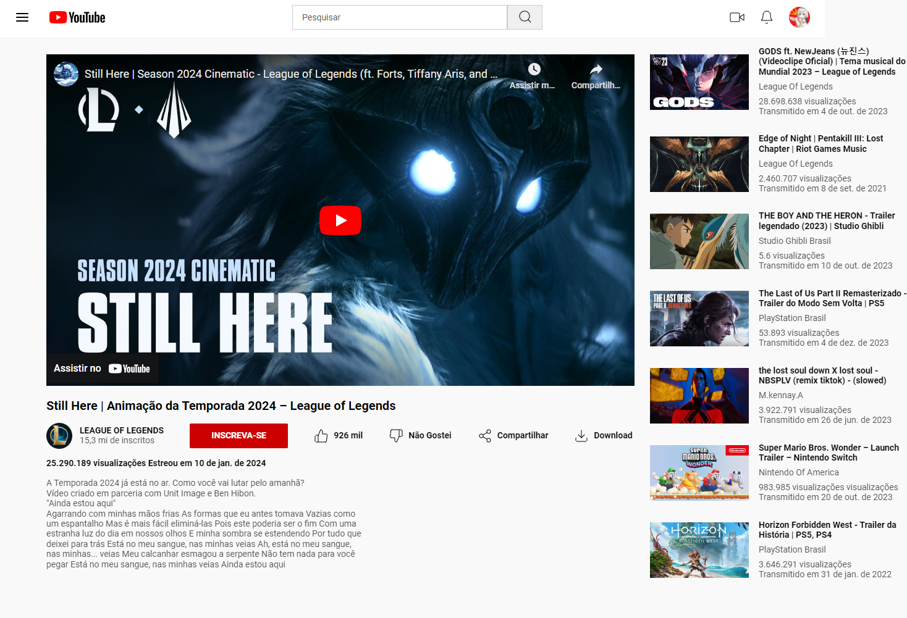

<h1 align="center">Clone Youtube</h1>

  

## 🚀 Tecnologias

Esse projeto foi desenvolvido com as seguintes tecnologias:

- HTML e CSS
- JavaScript 
- Git e Github

## 💻 Projeto
Projeto criado para o desafio DIO, clonar a platamorma do Youtube de forma estática, utlizando HTML E CSS, visando praticar os conceitos de Flexbox.

## :memo: Licença